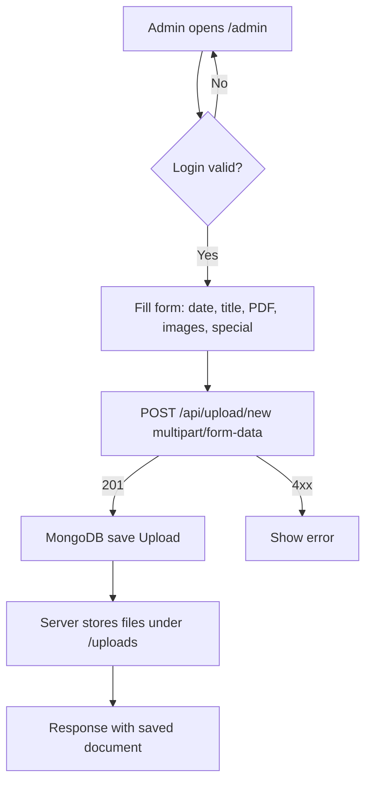

## PharmaCare Newspaper - Fullstack App

An end-to-end web app to publish and browse newspaper editions. Admins can upload a monthly edition as a PDF with optional page images; readers can browse by month, view pages, and download the PDF. Built with React + Vite (client) and Node.js/Express + MongoDB (server).

### Features
- One-page landing with sections: Home, About, Editions, Specials, Contact
- Editions screen: select month, view page images, download PDF
- Admin portal: upload new edition (PDF required, optional images, special flag)
- Media hosting served from server `/uploads`
- Structured logs with Winston; central error middleware

### Repository Structure
```
client/   # React + Vite frontend
server/   # Express + MongoDB backend, file uploads, API
```

---

## Quick Start

### Prerequisites
- Node.js 18+ and npm
- MongoDB instance (Atlas or local); a database named `NewsPaper` is used

### 1) Backend setup (server)
1. Open a terminal at `server/`.
2. Create `.env` with:
```
PORT=5000
MONGODB_URI=mongodb+srv://<user>:<password>@<cluster>/<db>?retryWrites=true&w=majority&appName=<app>
```
3. Install deps and run:
```
npm install
npm run dev
```
Server starts on `http://localhost:5000` and creates `server/uploads` and `server/logs` if missing.

### 2) Frontend setup (client)
1. Open a second terminal at `client/`.
2. Create `.env` with:
```
VITE_APP_URI_API=http://localhost:5000
```
3. Install deps and run:
```
npm install
npm run dev
```
Vite serves the app at `http://localhost:5173`. The backend CORS is preconfigured to allow this origin.

---

## Environment Variables

### Server (`server/.env`)
- `PORT` (optional, default 5000): Express port
- `MONGODB_URI` (required): MongoDB connection string

### Client (`client/.env`)
- `VITE_APP_URI_API` (required): Base URL of the backend API, e.g. `http://localhost:5000`

---

## Running in Development
- Start backend first (ensures DB is up), then frontend
- Access app at `http://localhost:5173`
- API base will be `VITE_APP_URI_API` (default `http://localhost:5000`)

---

## Build and Deploy
### Client
```
cd client
npm run build
```
Outputs to `client/dist`. Serve statically with any web server (Nginx, Vercel, Netlify, etc.).

### Server
- Deploy Node server (Render, Railway, VPS, etc.)
- Ensure writable `server/uploads` and `server/logs` directories
- Set `MONGODB_URI` and `PORT`
- Reverse proxy should forward requests to the server and serve the client separately

---

## Backend API

Base URL: `${VITE_APP_URI_API}` (e.g., `http://localhost:5000`)

Health
- `GET /` → "Welcome to the API"

Uploads
- `POST /api/upload/new`
  - Content-Type: `multipart/form-data`
  - Fields:
    - `title` (string, required)
    - `date` (string, optional; ISO or YYYY-MM-DD; defaults to now)
    - `isSpecialEdition` (boolean-like, optional)
    - `files` (files, required): must include exactly one PDF; may include 0..N images (jpg/jpeg/png/webp)
  - Responses:
    - 201: `{ message, data: { _id, title, date, pages: string[], pdfFile: string, isSpecialEdition } }`
    - 400: validation errors (missing PDF/title, invalid date, multiple PDFs)

- `GET /api/upload/data?month=YYYY-MM`
  - Query: `month` in `YYYY-MM` format, required
  - Response 200: `{ message, data: Array<{ _id, title, date, isSpecialEdition, pdfFile, pages[] }> }`
  - Notes: file paths are returned with leading slash; join with API base, e.g. `${API}${pdfFile}`

Static Media
- `GET /uploads/*` serves uploaded files

### Data Model (MongoDB)
`Upload` document fields:
- `title: string` (required)
- `date: Date` (default now)
- `pages: string[]` image paths
- `pdfFile: string` (required) PDF path
- `isSpecialEdition: boolean` (required)

---

## Frontend Overview

- `App.jsx`: Router with one-page layout (`/`) and `Admin` route
- `Navbar`: smooth-scroll navigation and Admin button
- `Home`, `About`, `Editions`, `Specials`, `ContactUs` sections
- `Editions`:
  - Controls a month input
  - Fetches `GET /api/upload/data?month=YYYY-MM`
  - Displays page images and provides a PDF download link
- `Admin`:
  - Simple in-page auth (email: `admin@example.com`, password: `password`)
  - `AdminPanel` INSERT tab posts `multipart/form-data` to `/api/upload/new`
  - UPDATE/DELETE are local state only (no backend endpoints implemented)
- `AuthContext` exposes `API` from `VITE_APP_URI_API`

---

## Usage Flowcharts

### Upload Edition (Admin)


### Browse Editions (Reader)
```mermaid
flowchart TD
  A[User opens /] --> B[Select month in Editions]
  B --> C[GET /api/upload/data?month=YYYY-MM]
  C -->|data found| D[Show first page image]
  D --> E[Prev/Next page controls]
  C -->|empty| F[Show "No edition found"]
  D --> G[Download PDF link to /uploads/...]
```

---

## Local Admin Credentials
- Email: `admin@example.com`
- Password: `password`

Note: This is client-side only and intended for local/demo. Replace with real authentication for production.

---

## Logging and Error Handling
- Winston logs to console and files under `server/logs` (`app.log`, `info.log`, `error.log`, etc.)
- Central error middleware formats Multer and generic errors

---

## CORS and Static Files
- Allowed origin: `http://localhost:5173`
- Static serving of uploaded media at `/uploads/*` with appropriate content-types

---

## Troubleshooting
- 400 on upload: ensure exactly one PDF is included and `title` is present
- 400 on fetch: ensure `month` is `YYYY-MM`
- CORS errors: verify client `VITE_APP_URI_API` matches server origin and server allows it
- Mongo connection error: verify `MONGODB_URI` in `server/.env`


